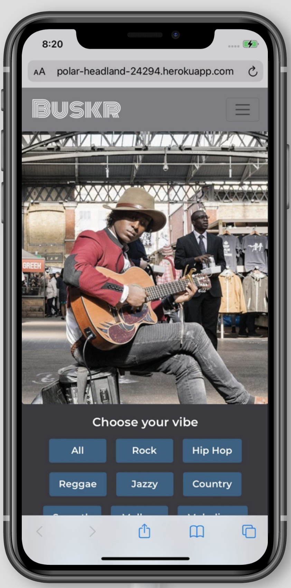
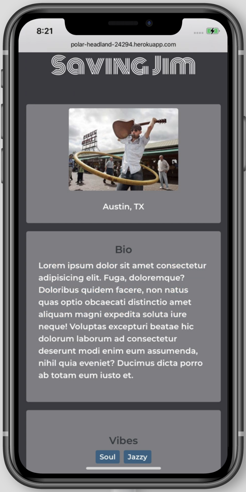
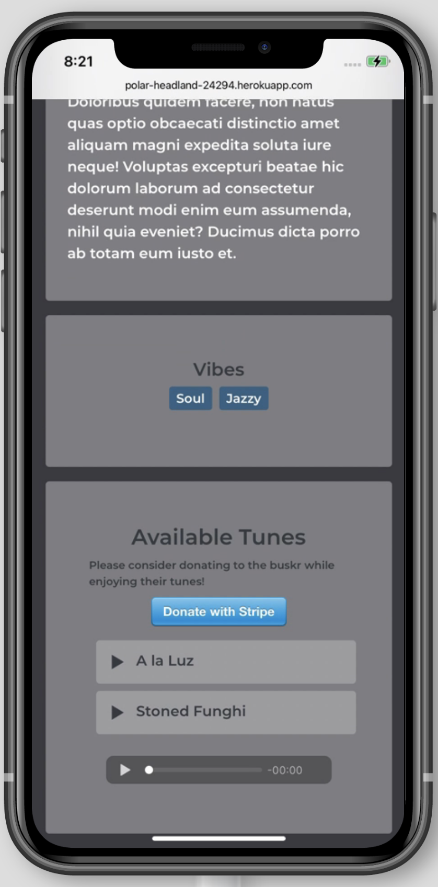

# Buskr 
UT Coding Bootcamp | Project 3

## Table of Contents
* [Links](#links)
* [Description](#description)
* [Installation](#installation)  
* [Usage](#usage)
* [Questions](#questions)

## Links
[Live Page](https://polar-headland-24294.herokuapp.com/)
[Pitch Deck](https://www.beautiful.ai/player/-ML31umLSLWPo5aGBVmk)

## Description
Buskr provides a platform for musicians to showcase their songs to music fans who are interested in breaking free from the global trendscape in order to discover local acts performing nearby. 

## Installation
* [Dependencies](#dependencies)
* [devDependencies](#devDependencies)

### Dependencies 
  
* root

      if-env

* server

      apollo-server-express
      bcrypt
      express
      jsonwebtoken
      mongoose
      stripe

* client

      @apollo/react-hooks
      @stripe/stripe-js
      @testing-library/jest-dom
      @testing-library/react
      @testing-library/user-event
      apollo-boost
      apollo-link-context
      graphql
      graphql-tag
      jwt-decode
      react
      react-bootstrap
      react-dom
      react-redux
      react-router-dom
      react-scripts
      redux
      react-icons

### devDependencies 

* root
        
        concurrently

* server

         nodemon

## Usage
[Screen Cap](https://share.getcloudapp.com/v1uxBdx7)

 

## Questions
_Please direct inquiries to any of the key contributors below. Specific competencies are indicated by contributor._  
[Christopher Concannon](https://github.com/christopherConcannon) (Back end + Data modeling)    
[Joseph Flanagan](https://github.com/josephptflanagan) (AWS integrations)  
[Jessica Jernigan](https://github.com/jessicajernigan) (Concept development + HiFi designs + test data + Some front end)  
[Matt Linden](https://github.com/geocode-matt) (Front end structure + styling)
